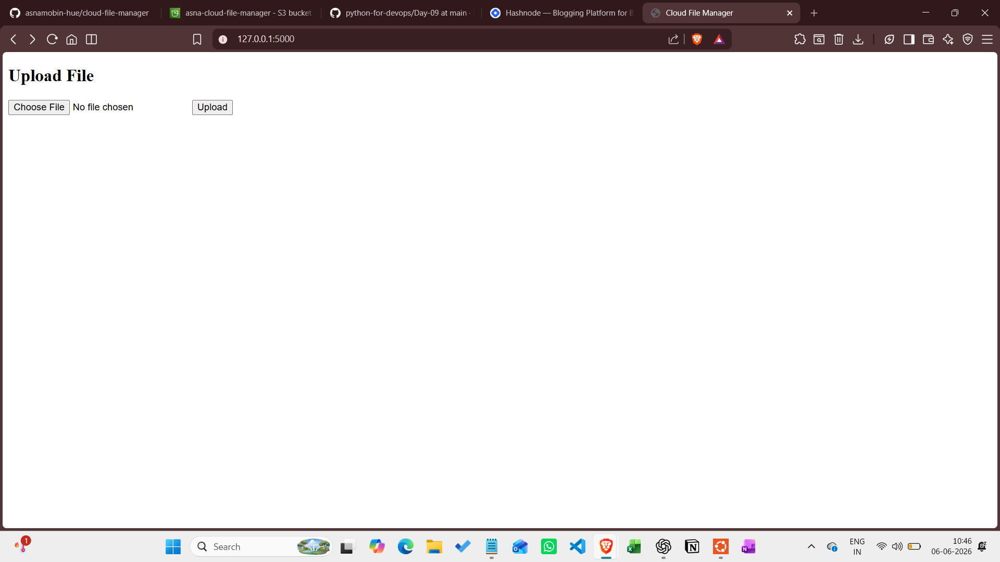

# Cloud File Manager

A web app where users can upload, store, download and delete image files using AWS S3. Built with Python, Flask, and Boto3.

## Preview



## Features

- Upload PNG/JPG files to AWS S3
- View all stored files with size and date
- Download files from cloud storage
- Delete files from S3
- 1MB file size limit
- File type validation (PNG and JPEG only)
- Files are stored in the cloud using AWS S3, so they are not dependent on local storage

## Tech Stack

| Category | Technology |
|----------|------------|
| Language | Python |
| Backend | Flask |
| Cloud Storage | AWS S3 |
| AWS SDK | Boto3 |
| Frontend | HTML + CSS |
| Config | python-dotenv |
| Containerization | Docker |
## Project Structure

```text
cloud-file-manager/
├── app.py
├── requirements.txt
├── README.md
├── templates/
│   └── index.html
├── screenshots/
└── .gitignore
```

## How to Run

```bash
git clone https://github.com/asnamobin-hue/cloud-file-manager.git
cd cloud-file-manager
python3 -m venv venv
source venv/bin/activate
pip install -r requirements.txt
```

Create a `.env` file:
```
AWS_ACCESS_KEY_ID=your_key
AWS_SECRET_ACCESS_KEY=your_secret
AWS_DEFAULT_REGION=us-east-1
S3_BUCKET_NAME=your_bucket
```

```bash
python3 app.py
```

## What I Learned

- How Flask handles backend routes and file uploads
- How Boto3 makes API calls to AWS services
- How GET and POST requests work in web apps
- How S3 stores and manages files in the cloud
- Deployed the app on AWS EC2
- Keeping credentials secure using .env files
- Also got basic understanding of how deployment works using EC2 and Docker

## Note

This project was deployed on AWS EC2 for testing purposes and may not always be running as the instance is stopped when not in use.
 
